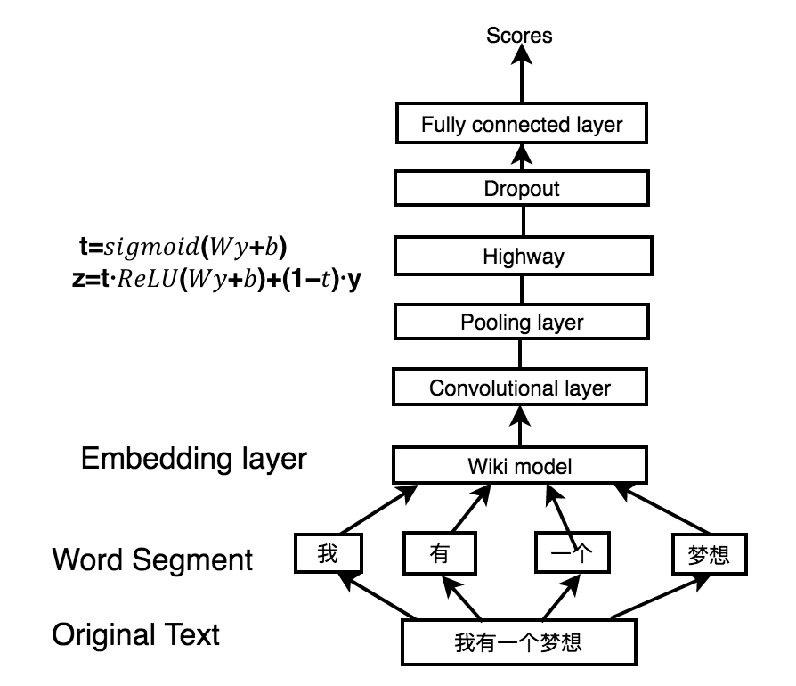

# Ensemble-based multi-model Text Classification
Text classification for Chinese. CNN, logistic regression and xgboost are tested.

The main model I tested was CNN with great improvement combined with xgboost ensemble. However, ensemble of logistic regression did't help a lot. 

## Intro

### Word Embedding
I use jieba to segment the text into words. I used word2vec to train on wiki model and apply a three-layer neural network to implement word embedding. This wiki model serves as a language probilistic model to predict the next word. By previous word, we use n-gram to model, which basically take the previous several words to predict.

### CNN classification

### Ensemble

Four genres of models are shown above. M1 is the previous mentioned CNN. M2 is single Xgboost. M3 is the ensembling of baseline models: logistic regression, Random forests, Naive Bayes. M is the top layer ensemble. The comparison of results are shown below.

## Data
The training data is provided by private drive from SJTU AI lab. 
